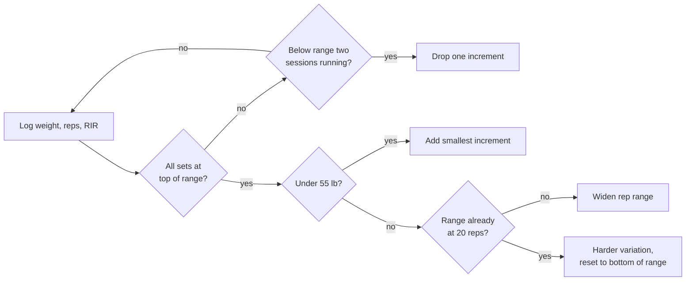
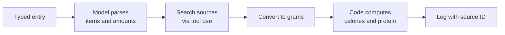

# Kumite: v0.1 spec

Started 2026-09-22. Last updated 2026-09-24. Owner: Chris.

In the repo, this file is the source of truth for product rules. `docs/PLAN.md` turns these rules into build tasks and precise engine rules.

## Purpose and priorities

The app picks a workout that fits Chris's available time and home equipment, then tracks and progresses every set. The goal is about 10 lb more muscle, 10 lb less fat, and 10 strict pull-ups (currently 2).

- Priority 1, workouts: suggest, track, and progress short sessions around kickboxing and MMA.
- Priority 2, food: manual entry with calorie and protein lookup, supporting fat loss.
- Deferred: photo-based calorie estimation, which will reuse the food lookup built for manual entry.

Baseline at kickoff (September 2026): age 45, 6'2", about 205 lb, works from home. Version 0.1 is single-user.

Look and feel: an original fighting-game style in the spirit of early-1990s arcade fighters: dark stone, blood red, fire, and carved gold lettering, with health bars for goals. All art is original, with no game or film logos, names, characters, or fonts. Working name: Kumite (repo kumite), after the Bloodsport tournament and the karate word for sparring.

## Inputs

The engine plans around these, set at onboarding and editable in Settings. Dumbbells to 55 lb plus a bench make this a dumbbell-first program, with bodyweight variations taking over once 55 lb runs out.

| Input | Current value | Used for |
| --- | --- | --- |
| Dumbbells | Adjustable pair up to 55 lb (settings entered at onboarding) | Load progression on every main lift |
| Bench | Adjustable, flat to incline | Flat and incline press, chest-supported rows, box squats, split squats, hip thrusts |
| Pull-up bar | Doorway bar, plus resistance bands | Pull-up progression toward 10 strict reps |
| Peloton bike | Yes | Easy rides and conditioning |
| Fight training | Kickboxing or MMA at the gym, 2 to 3 sessions a week, on days that change weekly | A gym day is that day's training; logged as it happens |
| Workday | At home | Desk sets through the day |
| Session length | 30-minute home workouts (20 when the week runs short), or a desk break | Time boxes |
| Knee | Five prior surgeries; squats and lunges OK | Knee-friendly defaults and a knee flag on squat sets |

## Weekly structure and session templates

Each week holds three 30-minute strength sessions, 2 to 3 fight sessions, 1 to 2 easy rides, daily desk sets, and one day off. Fight training days change every week, so the week runs on quotas and the engine picks each day's session from what's left.

| Per week | Target | Scheduling rule |
| --- | --- | --- |
| Home workouts | 3 sessions, alternating A and B | At least one day between sessions |
| Fight training | 2 to 3, logged as they happen | A gym day is the day's training; nothing else is suggested |
| Peloton | 60 minutes, rides or classes | Suggested on no-gym days when it is further behind than home workouts |
| Desk sets | Every workday | Run alongside everything else |
| Rest | At least 1 full day | No strength or fight training |

When the week runs short on days, the engine allows home workouts on back-to-back days in the 20-minute box.

| Session | Pair 1 | Pair 2 | Finisher |
| --- | --- | --- | --- |
| Strength A | Pull-up progression + dumbbell Romanian deadlift | Split squat or reverse lunge + dumbbell bench press | Plank |
| Strength B | Goblet box squat to the bench + seated dumbbell shoulder press | Chest-supported row on the incline bench + dumbbell hip thrust | Side plank |

- A pair is a superset: alternate the two exercises, then rest 60 to 90 seconds.
- 3 rounds per pair, dropping to 2 rounds in weeks 1 and 2 while soreness settles.
- Rep ranges: 8 to 12 on dumbbell lifts, 10 to 15 on single-leg and bodyweight moves.
- Every working set ends with 1 to 2 reps in reserve (reps you could still have done).
- Optional 5-minute arm finisher when time allows: curls paired with overhead triceps extensions.
- Peloton sessions can be rides or classes; any Peloton minutes count toward the weekly 60.
- Desk sets default to 100 push-ups a day, 25 chair squats an hour during work hours, and easy pull-up singles on the doorway bar. Each mini-set is about half the current max, and none count as hard sets. On a sore-knee day, glute bridges replace the squats.

Weekly targets count hard sets in four groups: push (chest, shoulders, triceps), pull (back, biceps), squat (quads), and hinge (glutes, hamstrings). An A, B, A week at 3 rounds gives about 9 per group. Targets run 6 in weeks 1 and 2, 9 in weeks 3 and 4, and 12 from week 5 when recovery holds (check-in averages of soreness 3 or lower and energy 3 or higher over the prior two weeks).

## Exercise library and progression

Each slot progresses by load first, then by reps, then by a harder variation once 55 lb runs out. Light loads still build muscle when sets end near failure, which is what makes the ceiling workable ([source](https://peerj.com/articles/17195.pdf)).

| Slot | Main exercises | After 55 lb |
| --- | --- | --- |
| Squat | Goblet box squat, split squat, reverse lunge; Bulgarian split squat once the knee tolerates it | Pause at the bottom, 3-second lowering |
| Hinge | Dumbbell Romanian deadlift, dumbbell hip thrust | Single-leg Romanian deadlift, single-leg hip thrust |
| Horizontal push | Dumbbell bench press | Incline press, pause reps, 3-second lowering, then feet-elevated push-ups |
| Vertical push | Seated dumbbell shoulder press | Standing press, slower lowering |
| Pull | Band-assisted pull-up, pull-up negatives, one-arm row, chest-supported or bent-over row | Lighter bands, then strict pull-ups; pauses and slower lowering on rows |
| Core | Plank, side plank, dead bug | Longer holds, hollow hold |

Legs will outgrow 55 lb first, and single-leg versions roughly double the load each leg carries.



Every working set still ends 1 to 2 reps short of failure, including the widened high-rep sets.

### Pull-up path to 10

Pull-ups progress by assistance instead of load: lighter bands, then strict reps, with a max test every 2 to 3 weeks. Pull-ups go first in Strength A, while fresh.

| Stage | Strength A work | Move on when |
| --- | --- | --- |
| 1 | Band-assisted pull-ups, 3 sets of 5 to 8, plus 3 negatives lowered over 3 to 5 seconds | All sets reach 8 with the current band |
| 2 | Same sets with the next lighter band | 8 reps with the lightest band |
| 3 | Strict sets ending 1 to 2 reps short of failure, then one band-assisted back-off set | Max test reaches 5 |
| 4 | Add a strict set or a rep each week | Max test reaches 8, then 10 |

Easy singles on the doorway bar through the workday add practice without much fatigue. Every pound of fat lost is a pound less to pull, so the recomp helps directly. The bands, entered at onboarding from heaviest to lightest, set the assistance steps.

## Suggestion engine

The app asks as little as possible. The home screen shows today's desk goals as health bars, this week's Peloton minutes and home workouts, and a nudge about whatever is behind. Two questions do the rest. Fixed rules, no model.

1. "At your desk?": one thing to do now, the desk exercise furthest behind its daily goal, sized as a mini-set. One tap logs it. Filling every desk goal for the day shows FLAWLESS.
2. "Gym today?" (the kickboxing or MMA gym): yes means that is the day's training. Nothing else is suggested, the class is logged afterward, and desk sets stay available but that day's desk goals do not count against the nudge or the streak.
3. No gym: the app suggests whatever is furthest behind this week, comparing home workouts (3) with Peloton minutes (60) as a share of each target. A home workout comes with "OK, here's what we're going to do" and the exercises; a Peloton suggestion names the minutes still needed. With both done, it is a rest day, with desk sets if wanted.
4. Nudge: whenever Peloton minutes are short for the week, the home screen says so, for example "You've done some desk sets, but you still need 50 minutes on the Peloton this week: a class or a ride."
5. The home workout: the A and B templates at the current progression step, 30 minutes (both pairs and the finisher), with each exercise's weight, reps, and sets. A knee flag on a squat set still swaps the rest of that exercise and drops it one rung next time.
6. No check-in in 0.1. The soreness, energy, knee, and fight-tomorrow rules stay in the engine but are switched off.

Calendar-aware slot suggestions come later (see Plan).

## Logging

Logging a set takes two taps, prefilled from last time, and everything else is derived from the log.

- Day one is a calibration session: for each exercise, find the weight done for 10 to 12 reps with 2 in reserve. It also records max push-ups and max bodyweight squats to size desk sets.
- Each working set logs weight (lb), reps, and reps in reserve (0 to 4 or more). Squat-slot sets also take a knee flag for pain above 3 out of 10.
- Every 4 weeks, one all-out push-up set checks whether reps-in-reserve guesses are drifting.
- Desk sets log through +N buttons per exercise.
- Fight sessions and rides log as sessions with minutes and effort (1 to 10). Rides also take Peloton's output and calorie figures.
- Calories burned in fight sessions use MET × body weight (kg) × hours, with MET values taken from the Compendium of Physical Activities at build time.
- Body metrics: morning weight daily (optional) and waist weekly, measured at the navel under the same conditions each time.

## Progress dashboard

A recomp shows up as waist down and strength up while weight holds roughly steady, so the dashboard shows all three together. Scale weight alone can sit flat while muscle rises and fat falls.

| Metric | From | What it signals |
| --- | --- | --- |
| 7-day average weight | Daily weigh-ins | Trend without daily water swings |
| Waist | Weekly tape measure | Fat loss |
| Estimated 1-rep max per exercise | Best set each session | Strength, comparable across rep ranges |
| Hard sets per muscle group vs weekly target | Set log | Training volume on pace |
| Desk-set totals and streak | Desk sets | Daily habit |
| Protein vs target | Food log | Muscle support, once food tracking ships |
| Max strict pull-ups | Max test every 2 to 3 weeks | Progress toward 10 |
| Knee pain | Set flags | Whether lower-body load suits the knee |

```latex
\text{e1RM} = w \times \left(1 + \frac{r}{30}\right)
```

This is the Epley formula, with w as the weight and r as the reps. Compare it within one exercise, since switching variations changes the load.

## Food tracking (secondary)

Food is logged in plain words: a small model parses the text, nutrition databases supply the numbers, and code does the math. Protein is the target that matters most for muscle.



The model never supplies a calorie number; it only parses text and picks among real search results.

| Order | Source | Covers | Terms |
| --- | --- | --- | --- |
| 1 | Food library | Anything logged and confirmed before | Free, instant |
| 2 | USDA FoodData Central | Whole foods, foods as eaten, branded products | Free with a key, 1,000 requests an hour, public domain ([source](https://fdc.nal.usda.gov/api-guide.html)) |
| 3 | FatSecret Basic | US foods, including restaurants | Free, 5,000 calls a day, attribution required; barcode lookups need a Premier tier ([source](https://platform.fatsecret.com/api-editions)) |
| 4 | Open Food Facts | Packaged goods by barcode | Open database |
| 5 | Web search | Local restaurant dishes | A model call with web search; saved with its URL and flagged low confidence |

- Protein target: about 185 g a day (2.0 g per kg), with 150 g as the floor. The research points to roughly 2 g per kg for men, including while losing weight ([source](https://www.strongerbyscience.com/protein-science/)).
- Calorie target: estimated maintenance minus a modest deficit, defaulting to 300 to 500 kcal a day. Maintenance starts from the Mifflin-St Jeor equation times an activity factor, then gets corrected from the weight trend after two weeks.
- The parsing model is small and fast (Haiku class) and runs server-side.
- Each log row stores grams, the source ID, and a snapshot of calories and protein, so database corrections can't rewrite history.

## Data model and architecture

Same stack and pattern as Baby Tracker: Next.js on Vercel, Supabase, a GitHub repo, and a PWA installed on the phone.

| Table | Holds | Key fields |
| --- | --- | --- |
| profile | Goals, targets, fight days | Height, baseline weight, protein target, weekly set target |
| equipment | What's available | Dumbbell weights list, bench type, pull-up bar |
| exercises | The library | Slot, variation rank, equipment tags, context tags, rep range |
| sessions | Workouts, fight sessions, rides | Type, date, minutes, check-in scores, effort |
| sets | Each working set | Session, exercise, weight (lb), reps, reps in reserve |
| desk\_sets | Mini-sets through the day | Exercise, reps, timestamp |
| body\_metrics | Weight and waist | Kind, value, timestamp |
| foods | Food library and lookup cache | Source, source ID, nutrients per 100 g, portion weights |
| food\_log | What was eaten | Food, grams, calorie and protein snapshot, raw text, confidence |

- Logs are append-only, and a correction is a new row; a correction can also void a row logged by mistake. Current weights, progression steps, weekly sets, and streaks are derived at read time.
- Server-side route handlers on Vercel hold the Anthropic and USDA keys as environment variables; no key ships to the browser.
- Row-level security on every table, with Supabase Auth for a single user: one email-and-password account, signed in once per device and kept signed in by the session refresh. No emailed links or codes.
- The workout engine is plain TypeScript with unit tests on the progression and pacing rules.

## Decisions

Thirty-seven decisions so far; new ones get appended with their date.

| Date | Decision | Why |
| --- | --- | --- |
| 2026-09-22 | Workouts are the core; food is secondary | Chris's stated priority |
| 2026-09-22 | Program is dumbbell-first (to 55 lb) with a bench | Equipment confirmed |
| 2026-09-22 | Photo calorie estimation deferred | Manual entry builds the lookup the photo feature will reuse |
| 2026-09-22 | Workout engine uses fixed rules with no model | Predictable, testable, and free to run |
| 2026-09-22 | Model parses food text only; numbers come from databases | Same food, same number every time, traceable to a source |
| 2026-09-22 | Progression runs load, then reps to 20, then a harder variation | Keeps progress going past the 55 lb ceiling |
| 2026-09-22 | Desk sets tracked apart from hard sets | Easy sets far from failure add movement and habit but little muscle |
| 2026-09-22 | Recomp judged on waist, strength, and 7-day weight together | Scale weight alone can hide a recomp |
| 2026-09-22 | Protein target of 2.0 g per kg (about 185 g) | Raised from 1.6 g per kg after reviewing the fuller research |
| 2026-09-22 | Food log snapshots nutrients at log time | Database corrections can't rewrite history |
| 2026-09-22 | Next.js, Vercel, Supabase, GitHub, PWA | Same stack as Baby Tracker |
| 2026-09-23 | Pull-ups lead Strength A, working toward 10 strict reps | Stated goal; doorway bar and bands available |
| 2026-09-23 | Week runs on quotas, with fight training logged as it happens | Fight days change every week |
| 2026-09-23 | Knee-friendly squat-slot defaults, a knee check-in, and a pain rule | Five prior knee surgeries; squats and lunges OK |
| 2026-09-23 | Chest-supported rows and incline press added | Bench is adjustable |
| 2026-09-23 | Dumbbell and band settings entered at onboarding | Adjustable pair; exact steps not needed up front |
| 2026-09-23 | Look: 80s arcade, red, white, and blue, 16/32-bit pixel art | Chris's direction; name still open |
| 2026-09-23 | Working name Kumite, repo kumite | Chris's pick; nods to Bloodsport and the karate word for sparring |
| 2026-09-23 | Weekly set targets count four groups: push, pull, squat, hinge | Matches the four main movement slots |
| 2026-09-24 | Sign-in is one email-and-password account, created in the Supabase dashboard with sign-ups off; replaces emailed 6-digit codes | Chris wants to stay signed in with no links or codes. Simpler than codes, and unlike Baby Tracker's anonymous sign-in, a wiped phone or new phone gets the history back by signing in again |
| 2026-09-24 | Supabase project settings: Data API on, automatic RLS on, new tables not exposed automatically | Migrations grant each table's actions on purpose, so log tables stay select and insert only at the permission level as well as in RLS |
| 2026-09-24 | Log tables get a `voided` column: a correction row with `voided = true` cancels the row it supersedes | A set logged by mistake needs a way out while the log stays append-only |
| 2026-09-24 | `desk_sets` also records seconds | Wall sits are a desk-break option and are timed, not counted |
| 2026-09-24 | Claude runs database commands from the cloud session with a Supabase access token, on one branch per PLAN task | Chris is not always at his PC; the same checks run locally in tests and against the hosted project |
| 2026-09-24 | Pull-up sets in Stages 1 to 3 follow the week's rounds, like every other pair | Pull-ups and deadlifts alternate cleanly as a superset, and the easier first weeks apply to pull-ups too |
| 2026-09-24 | Pull-up Stage 4 adds reps first, then sets: 3 sets of (max minus 2), one rep a week to max minus 1, then one set a week to 5 | Chris's pick; a new max test starts the cycle over |
| 2026-09-24 | The recovery check wins over the quota squeeze, which only overrides the one-day spacing rule | A bad check-in gets an easy day even when the week is short |
| 2026-09-24 | Core and arm finishers run at the week's rounds | Chris's pick; keeps every block on the same schedule |
| 2026-09-24 | Fight calories use Compendium code 15430 (martial arts, moderate pace, MET 10.3) for every session | Kickboxing and MMA sit under martial arts; one value keeps it simple |
| 2026-09-24 | The recovery check uses upper-body soreness and energy; sore legs alone get the leg cap and still train | As first written, overall soreness meant sore legs always forced an easy day, so the leg cap could never apply |
| 2026-09-24 | A home screen with desk goals and two questions ("At your desk?" and "Gym today?") replaces the check-in and time picker | Chris found the first mockup too complicated; the rules stay, the screen asks less |
| 2026-09-24 | "Gym" means the kickboxing or MMA gym; a gym day is that day's training, and desk sets are optional that day | Chris does nothing else on fight days |
| 2026-09-24 | Peloton goal of 60 minutes a week, rides or classes, replaces 1 to 2 easy rides | Chris's pick; minutes are simple to track and nudge on |
| 2026-09-24 | On a no-gym day the app suggests whichever is further behind: home workouts (3 a week) or Peloton minutes | Keeps the week balanced without Chris planning it |
| 2026-09-24 | No check-in in 0.1: the recovery, leg-cap, and knee check-in rules are switched off; the knee flag on a set stays | Chris wants no questions up front; the rules stay in the engine for later |
| 2026-09-24 | Look: an original fighting-game style in the spirit of early-1990s arcade fighters (dark stone, blood red, fire, gold) replaces red, white, and blue | Chris's pick after the second mockup; no game or film logos, names, characters, or fonts |
| 2026-09-24 | Task order: the look comes first, the idea button becomes a task, and the week view moves to the Parking lot | Chris wants to see Kumite early; the home screen now shows the week |

## Plan

Version 0.1 ships the workout core, food arrives in 0.2, and photo estimation stays last.

| Version | Scope |
| --- | --- |
| 0.1 | Onboarding and calibration, a home screen with desk goals and the "At your desk?" and "Gym today?" questions, the home workout with set logging and progression, Peloton and fight-class logging, an idea button |
| 0.2 | Manual food entry with the parse and lookup layer (food library and USDA), protein and calorie targets, daily totals |
| 0.3 | Dashboard: 7-day weight, waist, estimated 1-rep max charts; a lighter deload week every 6 to 8 weeks |
| 0.4 | FatSecret and Open Food Facts, barcode scanning, hourly desk-set nudges by web push |
| 0.5 | Calendar-aware slot suggestions from Google Calendar, including fight sessions, a weekly summary written by a model from the data |
| Later | Photo-based calorie estimation |

Work happens on feature branches from the start, so each version gets a Vercel preview URL before it reaches main. From the start of the build, this file is the source of truth, and the Claude Doc it came from is the planning record.

## Open questions

All questions are answered; dumbbell and band settings get entered during onboarding.

- [x] Are the dumbbells an adjustable pair, and in what steps (2.5 lb or 5 lb)? This sets the progression increments.
- [x] Is the bench flat or adjustable? Adjustable unlocks incline press and chest-supported rows.
- [x] Add a doorway pull-up bar? It is the main fix once rows at 55 lb get easy.
- [x] Which days and times are fight training?
- [x] Any joints or old injuries to plan around (shoulders, knees, lower back)?
- [x] App name and repo name.
- [x] What resistance are the bands (color or pounds of assistance)? This sets the pull-up assistance steps.
